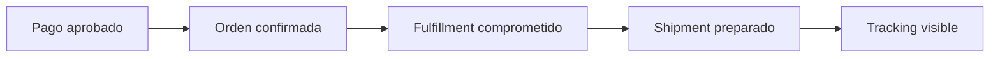
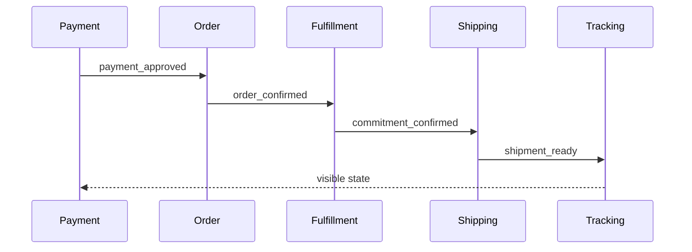

<style>
:root {
  --mf-yellow: #ffcc33;
  --mf-orange: #ff7a1a;
  --mf-red: #e53935;
  --mf-dark: #111827;
  --mf-muted: #6b7280;
  --mf-green: #16a34a;
  --mf-blue: #2563eb;
}
.slidev-layout {
  font-size: 1.05rem;
}
.kicker {
  letter-spacing: .08em;
  text-transform: uppercase;
  color: var(--mf-muted);
  font-size: .78rem;
  font-weight: 700;
}
.big-number {
  font-size: 4.5rem;
  line-height: .9;
  font-weight: 900;
}
.card {
  border: 1px solid #e5e7eb;
  border-radius: 16px;
  padding: 1rem 1.1rem;
  background: #ffffff;
  box-shadow: 0 6px 18px rgba(17,24,39,.06);
}
.card-dark {
  border-radius: 18px;
  padding: 1.1rem 1.25rem;
  background: #111827;
  color: #fff;
}
.danger {
  color: var(--mf-red);
  font-weight: 800;
}
.good {
  color: var(--mf-green);
  font-weight: 800;
}
.warn {
  color: var(--mf-orange);
  font-weight: 800;
}
.blue {
  color: var(--mf-blue);
  font-weight: 800;
}
.tiny {
  font-size: .78rem;
}
.small {
  font-size: .9rem;
}
.quote {
  font-size: 1.6rem;
  line-height: 1.25;
  font-weight: 750;
}
.clean-list li {
  margin: .35rem 0;
}
</style>

# Black Friday en llamas

## SRE GameDay para un marketplace en AWS

<div class="mt-8 quote max-w-4xl">
Producción no falla solo cuando un servicio cae. También falla cuando el equipo pierde la capacidad de saber qué está pasando y decidir qué sacrificar.
</div>

<div class="mt-10 kicker">Cloud Computing · AWS · Terraform · SRE · FIUBA</div>

<!--
Apertura con energía. No presentar como “clase de servicios AWS”. Presentar como una sala de crisis.
Decir: “Hoy usamos AWS, pero no venimos a memorizar AWS. Venimos a tomar decisiones técnicas con consecuencias”.
-->

---
layout: section
---

# 00:03

## Black Friday acaba de empezar

<!--
Pausa breve. Dejar respirar la tensión.
-->

---

# El sistema está verde. El negocio no.

<div class="grid grid-cols-2 gap-6 mt-8">
<div class="card">
<h3>Lo que dicen los dashboards</h3>
<ul class="clean-list">
<li>Health checks OK</li>
<li>Algunos HTTP 200</li>
<li>CPU “rara”, pero no crítica</li>
<li>Logs por todos lados</li>
</ul>
</div>
<div class="card">
<h3>Lo que dicen los usuarios</h3>
<ul class="clean-list">
<li>“Pagué y no veo mi compra”</li>
<li>“El tracking no se actualiza”</li>
<li>“Me prometieron entrega mañana”</li>
<li>“El seller no puede despachar”</li>
</ul>
</div>
</div>

<div class="mt-8 text-2xl font-bold">
Pregunta inicial: ¿qué les preocupa más: que el sistema esté caído o que parezca funcionar pero mienta?
</div>

<!--
Dinámica: pedir respuesta por chat: “caído”, “mentiroso”, “depende”.
Remate: en SRE, “up” no significa necesariamente “bien”.
-->

---

# Timeline del incendio

<div class="mt-8 grid grid-cols-6 gap-3 text-center">
<div class="card"><div class="kicker">23:20</div><b>Infra</b><br><span class="tiny">ajusta workers</span></div>
<div class="card"><div class="kicker">23:35</div><b>Seguridad</b><br><span class="tiny">cambia permisos</span></div>
<div class="card"><div class="kicker">23:40</div><b>Obs</b><br><span class="tiny">sube logging</span></div>
<div class="card"><div class="kicker">23:50</div><b>Producto</b><br><span class="tiny">activa feature</span></div>
<div class="card"><div class="kicker">00:00</div><b>Black Friday</b><br><span class="tiny">10x tráfico</span></div>
<div class="card"><div class="kicker">00:03</div><b>Reclamos</b><br><span class="tiny">primeras señales</span></div>
</div>

<div class="mt-10 quote">
No hubo “un gran cambio malo”. Hubo demasiadas certezas chicas, juntas, justo antes del pico.
</div>

<!--
Esta slide instala la hipótesis narrativa. No discutir técnica todavía.
Pregunta: “¿Rollback de qué, si cambiaron cinco cosas?”
-->

---
layout: section
---

# La misión

## Recuperar el flujo crítico, no arreglar el universo

<!--
Transición: ahora definimos qué estamos protegiendo.
-->

---

# Flujo crítico: Order-to-Ship



<div class="mt-8 grid grid-cols-2 gap-6">
<div class="card">
<h3>Lo que no alcanza</h3>
<p>“El checkout respondió 200.”</p>
<p>“La orden existe.”</p>
<p>“El servicio está healthy.”</p>
</div>
<div class="card">
<h3>Lo que necesitamos</h3>
<p>La compra se puede cumplir.</p>
<p>El seller puede despachar.</p>
<p>El comprador ve una verdad útil.</p>
</div>
</div>

<!--
Remarcar: una orden pagada todavía puede ser un incidente si no se puede cumplir o si el comprador no puede entender el estado.
-->

---

# Nuestra pregunta madre

<div class="card-dark mt-12">
<div class="text-4xl font-black leading-tight">
¿Qué sacrificamos para que el usuario todavía pueda comprar?
</div>
</div>

<div class="mt-10 grid grid-cols-3 gap-4">
<div class="card"><b>Producto</b><br><span class="tiny">features, conversión, promesas</span></div>
<div class="card"><b>Operación</b><br><span class="tiny">estabilidad, evidencia, rollback</span></div>
<div class="card"><b>Arquitectura</b><br><span class="tiny">acoplamiento, límites, fallas parciales</span></div>
</div>

<!--
Esta pregunta tiene que volver varias veces.
No dejar que la discusión se vaya a “qué servicio AWS es mejor” todavía.
-->

---

# Reglas de la war room

<div class="grid grid-cols-2 gap-6 mt-6">
<div class="card">
<h3>1. Primero síntoma, después causa</h3>
<p class="small">No diagnosticamos desde orgullo de equipo.</p>
</div>
<div class="card">
<h3>2. Primero usuario, después CPU</h3>
<p class="small">Las métricas técnicas son drill-down, no brújula.</p>
</div>
<div class="card">
<h3>3. Nadie toca nada sin predicción</h3>
<p class="small">Antes del cambio: ¿qué esperamos que mejore?</p>
</div>
<div class="card">
<h3>4. No buscamos culpables</h3>
<p class="small">Buscamos condiciones que hicieron posible el incidente.</p>
</div>
</div>

<!--
Pedir: “¿Cuál de estas reglas se rompe más seguido en empresas reales?”
-->

---

# El ciclo de cada decisión

<div class="mt-8">


</div>

<div class="mt-8 quote">
No ejecutamos comandos. Ejecutamos hipótesis.
</div>

<!--
Esta slide es clave para que los comandos no se coman la clase.
Cada demo debe pasar por este ciclo.
-->

---
layout: section
---

# SLO de emergencia

## ¿Qué significa “estar bien” durante Black Friday?

---

# Todos tienen razón. Nadie tiene verdad.

<div class="grid grid-cols-2 gap-6 mt-8">
<div class="card">
<h3>Señales internas</h3>
<ul class="clean-list">
<li>CPU alta</li>
<li>HTTP 200</li>
<li>errores intermitentes</li>
<li>backlog</li>
<li>logs ruidosos</li>
</ul>
</div>
<div class="card">
<h3>Dolor real</h3>
<ul class="clean-list">
<li>comprador no ve la compra</li>
<li>seller no puede despachar</li>
<li>tracking viejo</li>
<li>stock inconsistente</li>
<li>soporte saturado</li>
</ul>
</div>
</div>

<div class="mt-8 text-2xl font-bold">
¿Qué métrica representa mejor el dolor del comprador?
</div>

<!--
Votación rápida. Guiar hacia “pagos aprobados que llegan a tracking visible en menos de X tiempo”.
-->

---

# SLO de emergencia

<div class="card-dark mt-8">
<div class="text-3xl font-black leading-tight">
Durante la ventana crítica, 95% de pagos aprobados deben llegar a un estado visible para el comprador en menos de 2 minutos, sin duplicar orden ni vender stock inexistente.
</div>
</div>

<div class="grid grid-cols-4 gap-3 mt-8 text-center">
<div class="card"><b>Latencia</b><br><span class="tiny">pago → tracking</span></div>
<div class="card"><b>Correctness</b><br><span class="tiny">sin duplicados</span></div>
<div class="card"><b>Fulfillment</b><br><span class="tiny">stock cumplible</span></div>
<div class="card"><b>Freshness</b><br><span class="tiny">estado visible</span></div>
</div>

<!--
Decir: “Es un SLO imperfecto, pero explícito. Un SLO imperfecto explícito suele ser mejor que veinte dashboards perfectos sin decisión”.
Pregunta: “¿Qué tiene de bueno? ¿Qué tiene de malo?”.
-->

---

# Severidad didáctica: SEV-2

<div class="grid grid-cols-2 gap-8 mt-8">
<div class="card">
<h3>Por qué no es SEV-0/SEV-1</h3>
<ul class="clean-list">
<li>el sistema no está totalmente caído</li>
<li>algunas compras avanzan</li>
<li>hay señales técnicas disponibles</li>
</ul>
</div>
<div class="card">
<h3>Por qué sí es incidente</h3>
<ul class="clean-list">
<li>flujo crítico degradado</li>
<li>usuarios afectados</li>
<li>tracking poco confiable</li>
<li>cambios simultáneos</li>
</ul>
</div>
</div>

<div class="mt-8 quote">
“Parcialmente funcionando” puede ser la forma más cara de estar roto.
</div>

<!--
Preguntar: “¿Qué sería SEV-1 acá?”. Respuestas: pagos sin orden, ventas duplicadas, checkout caído, imposibilidad de reconstruir estado.
-->

---
layout: section
---

# Hands-on

## Repo, roles y producción heredada

---

# Bajamos el repo

<div class="kicker">Todos pueden seguir. Tres voluntarios operan.</div>

```bash
# Reemplazar por la URL real del repo
git clone <URL_DEL_REPO>
cd <REPO>
make doctor
```

<div class="mt-8 grid grid-cols-3 gap-4">
<div class="card"><b>make doctor</b><br><span class="tiny">valida entorno mínimo</span></div>
<div class="card"><b>runbooks</b><br><span class="tiny">muestran escenarios</span></div>
<div class="card"><b>faults</b><br><span class="tiny">activan comportamientos</span></div>
</div>

<!--
Aclarar: no necesitamos que todos desplieguen. El resto mira contracts, runbooks y participa como war room.
Si alguien no puede bajar el repo, sigue igual por pantalla.
-->

---

# Tres equipos, una producción

<div class="grid grid-cols-3 gap-4 mt-8">
<div class="card">
<h3>Checkout / Order</h3>
<p class="small">Convierte pagos aprobados en órdenes confiables.</p>
<p class="tiny">“Si acepto mal una compra, todos heredan basura.”</p>
</div>
<div class="card">
<h3>Fulfillment / Shipping</h3>
<p class="small">Convierte una orden en algo cumplible y despachable.</p>
<p class="tiny">“Una orden sin fulfillment es una promesa peligrosa.”</p>
</div>
<div class="card">
<h3>SRE / Buyer Experience</h3>
<p class="small">Dice si el usuario ve una verdad útil.</p>
<p class="tiny">“Si no podemos explicar qué pasó, sigue vivo.”</p>
</div>
</div>

<!--
Asignar voluntarios explícitamente.
Pedir al aula: ¿qué contrato mínimo tiene que existir entre estos equipos?
-->

---

# Deploy inicial: producción heredada

<div class="kicker">No desplegamos una versión limpia. Desplegamos una versión sospechosa.</div>

```bash
# Voluntario A
make deploy-checkout SCENARIO=blackfriday-broken

# Voluntario B
make deploy-fulfillment-shipping SCENARIO=blackfriday-broken

# Voluntario C
make deploy-tracking-sre SCENARIO=blackfriday-broken
```

<div class="mt-6 card">
<b>Mientras corre:</b> ¿qué puede salir mal cuando tres equipos cambian producción antes de Black Friday?
</div>

<!--
No esperar en silencio. Usar el tiempo para capturar riesgos: permisos, escalado, logging, feature nueva, falta de rollback, costos, colas.
-->

---

# Health check no es confianza

<div class="grid grid-cols-3 gap-4 mt-8">
<div class="card"><b>/healthz</b><br><span class="tiny">el proceso vive</span></div>
<div class="card"><b>/readyz</b><br><span class="tiny">el servicio cree estar listo</span></div>
<div class="card"><b>SLO</b><br><span class="tiny">el usuario recibe algo aceptable</span></div>
</div>

```bash
make health-check
make readiness-check
make version
```

<div class="mt-8 text-2xl font-bold">
¿Qué puede estar roto aunque health devuelva OK?
</div>

<!--
Respuestas: downstream, permisos, eventos, colas, tracking, stock, latencia, idempotencia.
Remate: health checks son necesarios, no suficientes.
-->

---
layout: section
---

# El camino feliz sospechoso

## Una compra funciona. ¿Y?

---

# Simulamos una compra

```bash
make simulate-payment ORDER=bf-001
make trace-order ORDER=bf-001
make show-tracking ORDER=bf-001
```

<div class="mt-6">



</div>

<!--
Antes de ejecutar, pedir predicción: “¿va a funcionar, fallar o funcionar parcialmente?”.
Si funciona: no celebrar demasiado.
Si falla: perfecto, es evidencia.
-->

---

# Un caso exitoso no prueba confiabilidad

<div class="grid grid-cols-2 gap-6 mt-8">
<div class="card">
<h3>Lo que sí prueba</h3>
<ul class="clean-list">
<li>existe un camino posible</li>
<li>los contratos mínimos pueden funcionar</li>
<li>tenemos algo para trazar</li>
</ul>
</div>
<div class="card">
<h3>Lo que no prueba</h3>
<ul class="clean-list">
<li>comportamiento bajo tráfico</li>
<li>idempotencia</li>
<li>freshness del tracking</li>
<li>capacidad de recuperación</li>
</ul>
</div>
</div>

<div class="mt-8 quote">
“Funcionó una vez” es una anécdota, no un SLO.
</div>

<!--
Esta slide evita que el primer happy path desinfle la tensión.
-->

---

# Correlation ID: la cuerda del incidente

```json
{
  "correlation_id": "checkout_bf_001",
  "payment_id": "pay_bf_001",
  "order_id": "ord_bf_001",
  "event": "orders.order_confirmed.v1",
  "service": "order-management"
}
```

<div class="mt-8 grid grid-cols-2 gap-6">
<div class="card"><b>Sin correlation_id</b><br>Opiniones, timestamps, suerte.</div>
<div class="card"><b>Con correlation_id</b><br>Historia reconstruible entre equipos.</div>
</div>

<!--
Mostrar logs filtrados si el repo lo permite.
Pregunta: “Si no tuviéramos correlation_id, ¿qué haríamos?”.
-->

---
layout: section
---

# Incidente 1

## Promesa Express rompe el flujo crítico

---

# La feature que quería ayudar

<div class="grid grid-cols-2 gap-6 mt-8">
<div class="card">
<h3>Promesa Express</h3>
<p class="text-2xl font-bold">“Comprá ahora y llega mañana”</p>
<p class="small">Más conversión. Mejor experiencia percibida. Más presión sobre fulfillment.</p>
</div>
<div class="card">
<h3>Costo oculto</h3>
<ul class="clean-list">
<li>más latencia</li>
<li>más dependencias</li>
<li>más estados visibles</li>
<li>más formas de mentir</li>
</ul>
</div>
</div>

<div class="mt-8 text-2xl font-bold">
¿Es parte del flujo crítico o es degradable?
</div>

<!--
Votación: crítica / degradable / depende / no sabemos.
Guiar: durante incidente probablemente debe poder degradarse.
-->

---

# Activamos Promesa Express v2

<div class="kicker">Técnicamente puede ser una env var. Narrativamente es un cambio de producto.</div>

```bash
make feature-promesa-express-on
make load-test-small
make show-slo
```

<div class="mt-8 grid grid-cols-4 gap-3 text-center">
<div class="card"><b>Errores</b><br><span class="tiny">intermitentes</span></div>
<div class="card"><b>Latencia</b><br><span class="tiny">p90/p99</span></div>
<div class="card"><b>Backlog</b><br><span class="tiny">eventos atrasados</span></div>
<div class="card"><b>Tracking</b><br><span class="tiny">viejo</span></div>
</div>

<!--
Antes de ejecutar: “¿Qué esperamos que pase con el SLO?”.
Importante: no explicar ERROR_RATE o TIMING como implementación todavía. Son palancas narrativas.
-->

---

# Decisión: ¿apagamos, degradamos o escalamos?

<div class="grid grid-cols-5 gap-3 mt-8 text-center small">
<div class="card"><b>A</b><br>mantener y escalar</div>
<div class="card"><b>B</b><br>apagar feature</div>
<div class="card"><b>C</b><br>degradar promesa</div>
<div class="card"><b>D</b><br>solo ciertos sellers</div>
<div class="card"><b>E</b><br>esperar más datos</div>
</div>

<div class="mt-10 quote">
¿Qué mata más negocio: apagar Promesa Express o degradar checkout?
</div>

<!--
Hacer votar. Pedir a dos alumnos que defiendan opciones opuestas.
Decisión recomendada: degradar a promesa genérica, no apagar todo.
-->

---

# Cura 1: degradación elegante

```bash
make feature-promesa-express-degrade
make load-test-small
make show-slo
```

<div class="mt-8 grid grid-cols-2 gap-6">
<div class="card">
<h3>Lo que sacrificamos</h3>
<p>Promesa logística menos precisa durante el pico.</p>
</div>
<div class="card">
<h3>Lo que protegemos</h3>
<p>El flujo de compra y la trazabilidad end-to-end.</p>
</div>
</div>

<div class="mt-8 quote">
La primera cura SRE no fue “más infraestructura”. Fue matar una dependencia no esencial.
</div>

<!--
Validar con show-slo. Si no mejora, eso también sirve: la feature era solo una causa contribuyente, no la única.
-->

---
layout: center
---

# Pausa breve

## Volvemos con rollback, backlog y permisos

<div class="mt-8 text-xl text-gray-500">Producción escuchó que estábamos cómodos.</div>

<!--
Pausa de 5-10 minutos según energía. Muy recomendable.
-->

---
layout: section
---

# Incidente 2

## Cambios simultáneos de infraestructura

---

# Rollback de qué, si cambiaron cinco cosas

<div class="mt-6 grid grid-cols-2 gap-6">
<div class="card">
<h3>Timeline</h3>
<ul class="clean-list small">
<li><b>23:20</b> workers/concurrencia</li>
<li><b>23:35</b> permisos</li>
<li><b>23:40</b> logging</li>
<li><b>23:50</b> Promesa Express</li>
<li><b>00:00</b> tráfico 10x</li>
<li><b>00:03</b> reclamos</li>
</ul>
</div>
<div class="card">
<h3>Trabajo de SRE</h3>
<ul class="clean-list small">
<li>separar síntomas de causas</li>
<li>congelar cambios no críticos</li>
<li>elegir rollback con evidencia</li>
<li>no introducir más caos</li>
</ul>
</div>
</div>

<!--
Preguntar: “¿Qué revertimos primero?”.
El objetivo no es adivinar la causa perfecta; es elegir una mitigación razonable y reversible.
-->

---

# El sistema no cae: se atrasa

```bash
make show-queues
make simulate-payments COUNT=50
make show-slo
```

<div class="mt-6 card-dark">
<div class="text-2xl font-bold">
Un servicio puede estar “up” y aun así incumplir la promesa al usuario.
</div>
</div>

<div class="mt-6 grid grid-cols-4 gap-3 text-center small">
<div class="card">pagos aceptados</div>
<div class="card">orders confirmadas</div>
<div class="card">fulfillment atrasado</div>
<div class="card">tracking viejo</div>
</div>

<!--
Mostrar backlog o indicadores equivalentes.
Preguntar: “¿Qué es peor ahora: aceptar más compras o frenar entrada?”.
-->

---

# Backpressure: decir que no también es confiabilidad

<div class="grid grid-cols-2 gap-6 mt-8">
<div class="card">
<h3>Opciones tentadoras</h3>
<ul class="clean-list">
<li>aceptar todo</li>
<li>escalar a ciegas</li>
<li>subir retries</li>
<li>mirar CPU</li>
</ul>
</div>
<div class="card">
<h3>Opciones operables</h3>
<ul class="clean-list">
<li>limitar entrada</li>
<li>priorizar órdenes pagadas</li>
<li>degradar no crítico</li>
<li>reducir ruido</li>
</ul>
</div>
</div>

<div class="mt-8 quote">
Escalar sin entender puede convertir un incidente técnico en un incidente técnico más caro.
</div>

<!--
Esta es una slide de principio, no de comando.
-->

---

# Cura 2: configuración segura

```bash
make fault-workers-too-slow-off
make apply-safe-worker-config
make observability-noise-reduce
make load-test-small
make show-slo
```

<div class="mt-8 grid grid-cols-3 gap-4">
<div class="card"><b>Menos ruido</b><br><span class="tiny">señal más clara</span></div>
<div class="card"><b>Workers estables</b><br><span class="tiny">menos backlog</span></div>
<div class="card"><b>Prioridad crítica</b><br><span class="tiny">órdenes pagadas primero</span></div>
</div>

<!--
Validar con SLO, no con “se siente mejor”.
Preguntar: “¿Qué métrica tendría que moverse si esta mitigación funcionó?”.
-->

---
layout: section
---

# Incidente 3

## Seguridad hizo lo correcto… casi

---

# Shipment bloqueado

<div class="grid grid-cols-2 gap-6 mt-8">
<div class="card">
<h3>Síntoma de negocio</h3>
<ul class="clean-list">
<li>seller no puede despachar</li>
<li>etiqueta no disponible</li>
<li>tracking queda en riesgo</li>
<li>comprador ve incertidumbre</li>
</ul>
</div>
<div class="card">
<h3>Causa candidata</h3>
<ul class="clean-list">
<li>permiso faltante</li>
<li>storage mal configurado</li>
<li>evento no publicado</li>
<li>documento no generado</li>
</ul>
</div>
</div>

<div class="mt-8 quote">
Buenas intenciones también rompen producción.
</div>

<!--
Introducir sin convertirlo en clase de IAM. El foco es: una falla técnica aparece como problema de negocio.
-->

---

# Falla controlada: documentos bloqueados

```bash
make fault-shipment-documents-blocked-on
make simulate-payment ORDER=bf-docs-001
make trace-order ORDER=bf-docs-001
```

<div class="mt-6 card">
<b>Evidencia esperada:</b>
<span class="small">shipping.dispatch_blocked, AccessDenied / publish failure / document unavailable, tracking degradado.</span>
</div>

<div class="mt-8 text-2xl font-bold">
Durante un incidente, ¿aceptarías un permiso más amplio por 30 minutos?
</div>

<!--
Votación: sí con expiración, no nunca, sí con blast radius, depende.
Guiar a condiciones: acotado, reversible, observable, registrado.
-->

---

# Cura 3: fix mínimo o permiso temporal

```bash
make fault-shipment-documents-blocked-off
make apply-shipment-permission-fix
make simulate-payment ORDER=bf-docs-002
make trace-order ORDER=bf-docs-002
```

<div class="mt-8 grid grid-cols-5 gap-3 text-center tiny">
<div class="card"><b>Acotada</b></div>
<div class="card"><b>Reversible</b></div>
<div class="card"><b>Observable</b></div>
<div class="card"><b>Registrada</b></div>
<div class="card"><b>Con owner</b></div>
</div>

<div class="mt-8 quote">
Least privilege no es pegarle a producción con una regla y rezar.
</div>

<!--
Si no hay implementación de IAM real, usar SQS_PUBLISH_FAILURE_MODE o falla de publish como equivalente narrativo.
No sobreexplicar.
-->

---
layout: section
---

# Incidente 4

## El comprador ve una mentira vieja

---

# Verdad interna vs verdad visible

<div class="grid grid-cols-2 gap-6 mt-8">
<div class="card">
<h3>Internamente</h3>
<ul class="clean-list">
<li>ORDER_CONFIRMED</li>
<li>FULFILLMENT_COMMITTED</li>
<li>SHIPMENT_READY</li>
</ul>
</div>
<div class="card">
<h3>Comprador ve</h3>
<p class="text-2xl font-bold danger">“Estamos procesando tu compra…”</p>
<p class="small">desde hace 12 minutos</p>
</div>
</div>

<div class="mt-8 quote">
El estado visible también es una promesa.
</div>

<!--
Pregunta: “¿Un sistema que procesa bien pero informa mal está sano?”.
-->

---

# Tracking freshness

```bash
make show-tracking ORDER=bf-001
make show-tracking-freshness
make trace-order ORDER=bf-001
```

<div class="mt-8 card-dark">
<div class="text-2xl font-bold">
Freshness no es cosmética. Es confiabilidad percibida.
</div>
</div>

<div class="mt-8 text-2xl font-bold">
¿Qué estado mostramos si no estamos seguros?
</div>

<!--
Opciones: último confirmado, “en actualización”, ocultar detalle, estado optimista.
Guiar: mejor estado honesto que mentira optimista.
-->

---

# Cura 4: estado honesto y replay

```bash
make fault-tracking-lag-off
make prioritize-tracking-events
make replay-tracking-events ORDER=bf-001
make show-tracking ORDER=bf-001
```

<div class="mt-8 grid grid-cols-2 gap-6">
<div class="card">
<h3>Protegemos</h3>
<p>La confianza del comprador y la capacidad de soporte de reconstruir.</p>
</div>
<div class="card">
<h3>Evitar</h3>
<p>Estados optimistas que el sistema no puede demostrar.</p>
</div>
</div>

<!--
Si no hay replay implementado, se puede mostrar logs precargados o endpoint de tracking corregido.
-->

---
layout: section
---

# ¿Volvimos a estar defendibles?

## Re-test del flujo crítico

---

# Repetimos el journey

```bash
make simulate-payments COUNT=20
make show-slo
make show-queues
make show-errors
make show-tracking-summary
```

<div class="mt-8 grid grid-cols-2 gap-6">
<div class="card">
<h3>Buscamos mejora</h3>
<ul class="clean-list small">
<li>pago → tracking bajo 2 min</li>
<li>sin órdenes duplicadas</li>
<li>menos backlog</li>
<li>shipment recuperado</li>
</ul>
</div>
<div class="card">
<h3>No declaramos magia</h3>
<ul class="clean-list small">
<li>no está perfecto</li>
<li>no todo quedó explicado</li>
<li>hay riesgo residual</li>
<li>falta postmortem</li>
</ul>
</div>
</div>

<!--
Votación: resuelto / mitigado / activo / no sabemos.
Respuesta ideal: mitigado.
-->

---

# Decisiones y riesgos aceptados

<div class="grid grid-cols-2 gap-6 mt-6">
<div class="card">
<h3>Decisiones tomadas</h3>
<ul class="clean-list small">
<li>Promesa Express degradada</li>
<li>workers estabilizados</li>
<li>permisos/documentos corregidos</li>
<li>tracking priorizado</li>
<li>ruido reducido</li>
</ul>
</div>
<div class="card">
<h3>Riesgos aceptados</h3>
<ul class="clean-list small">
<li>promesa menos precisa</li>
<li>menor conversión temporal</li>
<li>operaciones diferidas</li>
<li>permiso temporal si aplicó</li>
<li>deuda de análisis</li>
</ul>
</div>
</div>

<div class="mt-8 quote">
La IA puede sugerir opciones. El riesgo lo firma el equipo.
</div>

<!--
Preguntar: “¿Cuál riesgo es más incómodo de defender frente a negocio?”.
-->

---
layout: section
---

# Postmortem de bolsillo

## No preguntamos “quién rompió producción”

---

# La pregunta correcta

<div class="card-dark mt-12">
<div class="text-4xl font-black leading-tight">
¿Qué condiciones hicieron razonable que esto pasara?
</div>
</div>

<div class="mt-10 text-2xl">
No buscamos héroes. Buscamos sistemas que no dependan de héroes.
</div>

<!--
Decir: “La pregunta tentadora es quién rompió producción. La pregunta útil es qué permitió que tantos cambios riesgosos entraran juntos”.
-->

---

# Nota de guardia

<div class="grid grid-cols-2 gap-6 mt-4 small">
<div class="card">
<b>Impacto</b><br>
Compradores con pagos aprobados no veían tracking confiable; sellers tenían shipments bloqueados.
</div>
<div class="card">
<b>SLO degradado</b><br>
Pago aprobado → tracking visible bajo 2 minutos.
</div>
<div class="card">
<b>Cambios contribuyentes</b><br>
Promesa Express, workers, permisos, logging, falta de freeze.
</div>
<div class="card">
<b>Mitigación</b><br>
Degradar feature, estabilizar workers, corregir permisos, priorizar tracking.
</div>
<div class="card">
<b>Riesgo aceptado</b><br>
Promesa logística menos precisa durante ventana crítica.
</div>
<div class="card">
<b>Acción preventiva</b><br>
Feature flags, freeze, runbook, SLO antes de launch, GameDay previo.
</div>
</div>

<!--
Actividad: completar por chat. Esta slide puede quedar como cierre escrito.
-->

---

# Guardrails que valen más que culpas

<div class="grid grid-cols-3 gap-4 mt-8">
<div class="card"><b>Freeze</b><br><span class="tiny">antes de eventos críticos</span></div>
<div class="card"><b>Feature flags</b><br><span class="tiny">degradación rápida</span></div>
<div class="card"><b>Rollback probado</b><br><span class="tiny">no improvisado</span></div>
<div class="card"><b>SLO de journey</b><br><span class="tiny">antes del launch</span></div>
<div class="card"><b>Runbook</b><br><span class="tiny">acciones claras</span></div>
<div class="card"><b>GameDay</b><br><span class="tiny">practicar antes</span></div>
</div>

<div class="mt-8 text-2xl font-bold">
¿Qué guardrail habría evitado depender de gente perfecta?
</div>

<!--
Última discusión conceptual antes del cleanup.
-->

---
layout: section
---

# Cleanup

## Levantar recursos es fácil. Olvidarlos también.

---

# Cleanup también es operar

```bash
make cleanup-check
make destroy
make cleanup-verify
```

<div class="mt-8 grid grid-cols-2 gap-6 small">
<div class="card">
<h3>Verificar</h3>
<ul class="clean-list">
<li>compute apagado/eliminado</li>
<li>bases eliminadas o esperadas</li>
<li>colas eliminadas</li>
<li>buckets vacíos/eliminados</li>
</ul>
</div>
<div class="card">
<h3>No olvidar</h3>
<ul class="clean-list">
<li>snapshots no deseados</li>
<li>load balancers</li>
<li>IPs elásticas</li>
<li>recursos cobrables huérfanos</li>
</ul>
</div>
</div>

<!--
Aclarar: cleanup no es administración aburrida. Es responsabilidad cloud.
-->

---
layout: section
---

# Cierre

## Hoy usamos AWS. El problema no era AWS.

---

# Qué aprendimos realmente

<div class="grid grid-cols-2 gap-6 mt-6">
<div class="card">
<h3>Cloud</h3>
<p>Elasticidad, permisos, costo, medición y fallas parciales.</p>
</div>
<div class="card">
<h3>Terraform / IaC</h3>
<p>Cambios auditables, repetibles y reversibles.</p>
</div>
<div class="card">
<h3>SRE</h3>
<p>Promesas explícitas, evidencia, mitigación y aprendizaje.</p>
</div>
<div class="card">
<h3>Arquitectura</h3>
<p>Decidir qué puede fallar sin destruir el flujo crítico.</p>
</div>
</div>

<div class="mt-8 quote">
No construimos una demo de AWS. Recuperamos un flujo crítico usando AWS como laboratorio de decisiones.
</div>

<!--
Cierre fuerte. Evitar volver a listar servicios.
-->

---

# Frase final

<div class="card-dark mt-16">
<div class="text-4xl font-black leading-tight">
La nube te deja moverte rápido.
<br />
SRE te obliga a preguntar si moverte rápido está salvando el negocio o incendiándolo con más estilo.
</div>
</div>

<!--
Fin de la clase.
-->

---
layout: section
---

# Apéndice

## Para speaker notes, fallback y comandos

---

# Variables como narrativa

<div class="small">

| Mecanismo | Narrativa en la clase |
|---|---|
| `SERVICE_VERSION=v2` | Promesa Express activada |
| `ERROR_RATE` | feature nueva introduce errores intermitentes |
| `ERROR_TYPE=delay` | dependencia lenta antes de fallar |
| `TIMING_90_PERCENTILE` / `TIMING_99_PERCENTILE` | p90/p99 degradados |
| `RATE_LIMIT` | protección o mala configuración de entrada |
| `SQS_PUBLISH_FAILURE_MODE` | falla al publicar evento crítico |
| `CPU_BURN_ENABLED` | workers saturados por cambio de infra |
| `MEMORY_PRESSURE_ENABLED` | memory leak / pressure simulado |
| `VERBOSE_LOGGING` | observabilidad ruidosa y costosa |

</div>

<div class="mt-6 quote">
Técnicamente son env vars. Operativamente son cambios de producción. Pedagógicamente son decisiones con consecuencias.
</div>

<!--
Usar solo si alguien pregunta “¿cómo están metiendo las fallas?”. No adelantar demasiado en la narrativa principal.
-->

---

# Si la demo falla

<div class="grid grid-cols-2 gap-6 mt-8">
<div class="card">
<h3>No decir</h3>
<p>“Esperen, lo arreglo en dos minutos.”</p>
<p class="tiny">Nunca prometer trabajo futuro ni dejar a todos mirando una consola rota.</p>
</div>
<div class="card">
<h3>Decir</h3>
<p>“Esto también es producción. Pasamos al fallback y seguimos con la decisión.”</p>
<p class="tiny">La clase no depende de que todo salga perfecto.</p>
</div>
</div>

<div class="mt-8 small">
Fallbacks sugeridos: endpoint docente, logs precargados, capturas, outputs Terraform, dataset de eventos, recording corto.
</div>

<!--
Esta slide es para el docente. No necesariamente se muestra en vivo.
-->

---

# Preguntas para levantar la sala

<ul class="clean-list text-xl mt-6">
<li>¿CPU alta es un incidente si los usuarios todavía compran?</li>
<li>¿Qué es peor: rechazar una compra o aceptar una compra que no podés cumplir?</li>
<li>¿Escalar arregla el incidente o solo lo vuelve más caro?</li>
<li>¿Un sistema que procesa bien pero informa mal está sano?</li>
<li>¿Durante un incidente aceptarías un permiso más amplio por 30 minutos?</li>
<li>¿Rollback de qué, si cambiaron cinco cosas?</li>
<li>¿Qué riesgo firmarías con tu nombre?</li>
</ul>

<!--
Usar como banco de preguntas cuando haya tiempos muertos o comandos corriendo.
-->

---

# Comandos principales del taller

```bash
make doctor
make deploy-checkout SCENARIO=blackfriday-broken
make deploy-fulfillment-shipping SCENARIO=blackfriday-broken
make deploy-tracking-sre SCENARIO=blackfriday-broken

make simulate-payment ORDER=bf-001
make simulate-payments COUNT=20
make trace-order ORDER=bf-001
make show-slo
make show-queues
make show-tracking-freshness

make feature-promesa-express-on
make feature-promesa-express-degrade
make apply-safe-worker-config
make apply-shipment-permission-fix
make prioritize-tracking-events

make cleanup-check
make destroy
make cleanup-verify
```

<!--
Ajustar nombres a los targets reales del repo antes de usar en clase.
-->

---

# Fin

<div class="mt-16 quote">
Black Friday no perdona arquitecturas que solo funcionan en diagramas.
</div>

