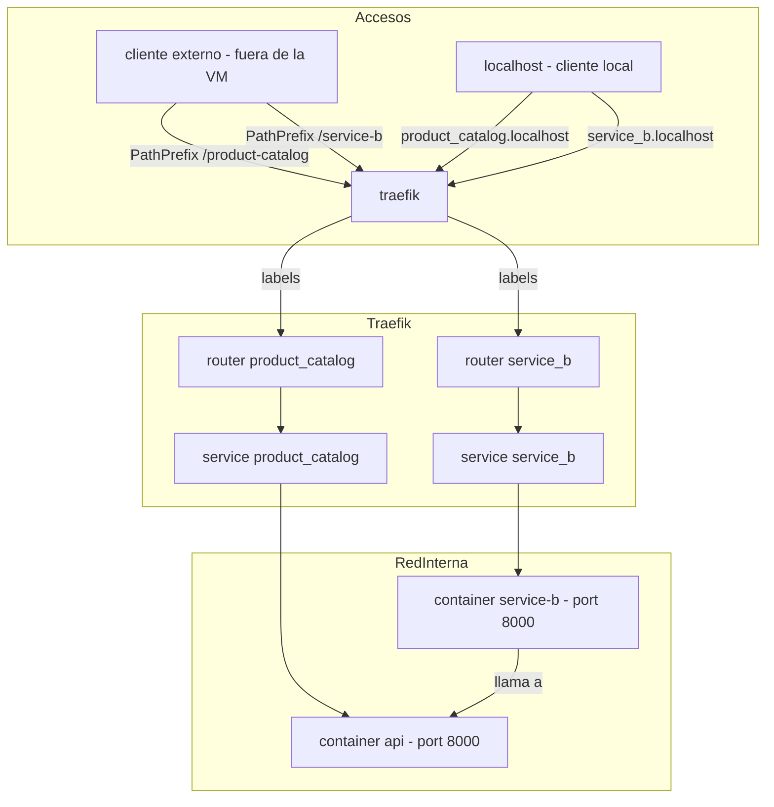
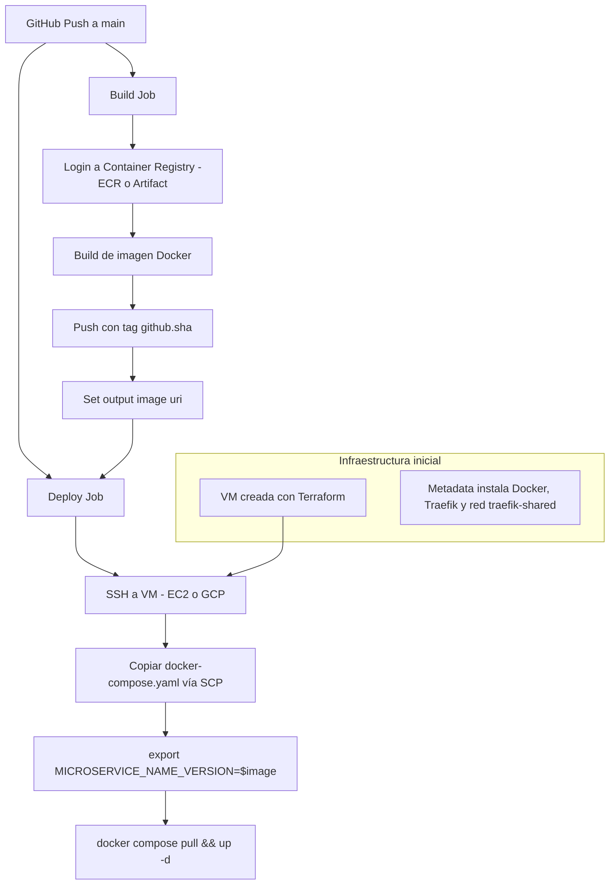

# 🚀 Cloud Computing Demo - Ingeniería del Software II  

Este repositorio contiene instrucciones detalladas y recursos utilizados durante la clase práctica de Cloud Computing. Aquí aprenderás desde los primeros pasos básicos hasta prácticas avanzadas con infraestructura como código y pipelines CI/CD usando AWS y GCP.

**Diapos**: [Cloud Computing Slides](https://www.figma.com/deck/yJpxpjW6aJOpFBCW7TE1xW/ISW2---Cloud-Computing?node-id=1-660&t=ep8V4cm1Nw0F9j6b-1)

## 🧱 Paso 0: Configuración Inicial de AWS

Antes de empezar, asegurate de configurar correctamente tu entorno AWS:

**Video Explicativo**: [AWS Setup](https://drive.google.com/file/d/19cXLmVaiaNkhtlqN130TJ3S2vEd0XeDB/view)

### 🌐 Creación de Cuenta AWS

1. Ingresa a [AWS Sign-up](https://aws.amazon.com) y crea una cuenta nueva con tu correo electrónico.
2. Verifica tu dirección email mediante el código enviado por AWS.
3. Selecciona tipo de cuenta: **Personal**.
4. Realiza la verificación con tarjeta de crédito/débito.
5. Completa la verificación con número de teléfono (SMS).
6. Selecciona el plan **Basic Support** (gratuito).

### 💳 Gestión de Costos y Alertas  

1. Activa el acceso al panel de Billing desde IAM.
2. En Billing → **Alert Preferences**, configura alertas vía email.
3. En Budgets, crea un presupuesto llamado **Zero spend budget** para monitorear gastos en tiempo real.

### 🔐 Creación de Usuario IAM y CLI  

1. En IAM, crea un usuario administrador: `iamadmin` y habilita MFA (Autenticación Multifactor).
2. Guarda tu URL de login personalizada para IAM:
    ```
    https://<account_id>.signin.aws.amazon.com/console
    ```
3. Descarga e instala la [AWS CLI](https://aws.amazon.com/cli/).

### 🖥️ Configuración Local con AWS CLI  

Configura tu usuario IAM localmente:

```bash
aws configure --profile iamadmin-general
```

Verifica configuración:

```bash
aws sts get-caller-identity --profile iamadmin-general
```

---

## ☁️ Demo 1: Lanzando Tu Primera Instancia EC2

Aprenderás a desplegar y acceder a una máquina virtual en la nube AWS.

### 🔑 Generar Key Pair

- Ve a EC2 → Key Pair → Crea una nueva clave y descárgala (`tu_key.pem`).

### 🚦 Crear Security Group

- Configura un Security Group que permita conexiones SSH (puerto 22) desde cualquier IP (`0.0.0.0/0`).

### 🚀 Lanzar Instancia EC2  

- Selecciona instancia tipo `t2.micro` con Ubuntu Linux.
- Usa la clave y Security Group creados anteriormente.

### 🔌 Conexión SSH a EC2  

```bash
ssh -i "tu_key.pem" ubuntu@<EC2_PUBLIC_IP>
```

### 🗑️ Destruir instancia

- Ve a EC2 → Instancias → Selecciona la instancia y destrúyela.
- Elimina el Security Group creado.
- Elimina la Key Pair.


### 🌳 Automación con Terraform  

Automatiza estos pasos con Terraform:

```bash
terraform init
terraform plan -var="ssh_key_name=tu_ssh_key_name"
terraform apply -var="ssh_key_name=tu_ssh_key_name"
terraform destroy -var="ssh_key_name=tu_ssh_key_name"
```

📁 **Assets:** disponibles en carpeta [**01-demo**](https://github.com/ingenieria-del-software-2/cloudcomputing-demo/tree/main/01-demo)

---

## 🗃️ Demo 2: Gestión de Acceso con IAM y S3

Control de acceso y políticas IAM avanzadas con CloudFormation.

### 📦 Despliegue CloudFormation Stack  

La plantilla crea:

- Dos buckets S3 (`animals` y `dogs`).
- Usuario IAM: `Messi`.
- Política IAM: acceso a todo excepto al bucket `dogs`.

### 📤 Uso del Bucket S3  

- En `animals`: sube imágenes de gatos.
- En `dogs`: sube imágenes de perros.

### 🛡️ Verificación Acceso IAM  

- Inicia sesión con usuario Messi en ventana incógnita.
- Intenta acceder al bucket `dogs`: **el acceso debe ser denegado**.

### 🔧 Modificación de la Política  

- Elimina política actual.
- Aplica política que permita **únicamente acceso al bucket `dogs`**.

### 🗑️ Limpieza  

- Elimina archivos S3.
- Desasocia política IAM del usuario Messi.
- Destruye stack CloudFormation.

📁 **Assets:** disponibles en carpeta [**2-demo**](https://github.com/ingenieria-del-software-2/cloudcomputing-demo/tree/main/01-demo)

---

## 🔄 Demo 3: CI/CD con EC2, Docker y Traefik

Esta demo está completamente automatizada con **Terraform**. En el bloque `user_data` (metadata de EC2) se incluye:

- Instalación de Docker y Docker Compose.
- Creación de red compartida `traefik-shared`.
- Despliegue único de Traefik y Jaeger con Compose.

Cada microservicio se encuentra en su propio repositorio y tiene su propio archivo `docker-compose.yaml` que referencia la variable `<MICROSERVICE_NAME>_VERSION`, la cual es inyectada automáticamente en el deploy desde GitHub Actions. Ejemplos: [kiosko-fiuba-product-catalog](https://github.com/ingenieria-del-software-2/kiosko-fiuba-product-catalog/blob/main/docker-compose.yml) y [kiosko-fiuba-shopping-experience](https://github.com/ingenieria-del-software-2/kiosko-fiuba-shopping-experience/blob/main/docker-compose.yml)

Además, esta demo cuenta con una **versión opcional para GCP**, que replica el mismo pipeline y despliegue utilizando una VM en Google Cloud y `gcloud CLI` en lugar de AWS CLI.

📁 Los assets para esta demo están en la carpeta [**03-demo**](https://github.com/ingenieria-del-software-2/cloudcomputing-demo/tree/main/03-demo)

### Diagrama de arquitectura de los servicios (Traefik y Microservicios)



### Pipeline CI/CD



## 🔐 Secrets utilizados en el pipeline (GitHub Actions)

### **🔸 AWS**

| Secreto                  | Descripción                                                                  |
|--------------------------|------------------------------------------------------------------------------|
| `AWS_ACCESS_KEY_ID`      | Access key del usuario IAM `pipeline-user`                                   |
| `AWS_SECRET_ACCESS_KEY`  | Secret key del usuario IAM `pipeline-user`                                   |
| `AWS_ACCOUNT_ID`         | ID de la cuenta AWS (solo números, sin espacios ni guiones)                  |
| `EC2_HOST`               | Dirección IP o DNS público de la instancia EC2                               |
| `EC2_SSH_KEY`            | Clave privada del Key Pair utilizado por EC2 (en texto plano, sin passphrase) |

> 🔁 El `ECR_URI` ahora se construye automáticamente en el pipeline como:  
> `${{ secrets.AWS_ACCOUNT_ID }}.dkr.ecr.us-east-1.amazonaws.com`

### **🔹 GCP**

| Secreto                   | Descripción                                                                 |
|---------------------------|-----------------------------------------------------------------------------|
| `GCP_SERVICE_ACCOUNT_KEY` | JSON con credenciales del Service Account `pipeline-user`                   |
| `GCP_VM_HOST`             | Dirección IP o DNS público de la instancia GCP                              |
| `GCP_SSH_KEY`             | Clave privada utilizada para conectar vía SSH (sin passphrase, en texto plano) |
| `GCP_PROJECT_ID`          | ID del proyecto de GCP                                                      |
| `REGION`                  | Región de Artifact Registry en GCP (ejemplo: `us-central1`)                 |


### 🔐 Permisos del Pipeline

Tanto en AWS como en GCP, se automatiza la creación de los permisos necesarios usando **Terraform**, con excepción de las credenciales secretas necesarias para CI/CD (las access keys en AWS y las keys de service account en GCP), que **deben generarse manualmente**.

#### AWS - IAM User para ECR

```bash
# Crear usuario IAM
aws iam create-user --user-name pipeline-user

# Asignar permisos para acceso total a ECR
aws iam attach-user-policy \
  --user-name pipeline-user \
  --policy-arn arn:aws:iam::aws:policy/AmazonEC2ContainerRegistryPowerUser

# (Manual) Crear una access key (guárdala en GitHub Secrets)
aws iam create-access-key --user-name pipeline-user
```

Este flujo estará definido en Terraform, excepto la generación de la access key, que debe guardarse como secreto en GitHub Actions (`AWS_ACCESS_KEY_ID`, `AWS_SECRET_ACCESS_KEY`).

#### GCP - Service Account para Artifact Registry

```bash
# Crear Service Account
gcloud iam service-accounts create pipeline-user --display-name "Pipeline User"

# Obtener el ID del proyecto
PROJECT_ID=$(gcloud config get-value project)

# Asignar el rol de escritor en Artifact Registry
gcloud projects add-iam-policy-binding $PROJECT_ID \
  --member="serviceAccount:pipeline-user@$PROJECT_ID.iam.gserviceaccount.com" \
  --role="roles/artifactregistry.writer"

# (Manual) Crear una key JSON (guárdala en GitHub Secrets)
gcloud iam service-accounts keys create ./pipeline_credentials.json \
  --iam-account=pipeline-user@$PROJECT_ID.iam.gserviceaccount.com
```

La infraestructura de GCP (VM, red, permisos) está escrita en Terraform, excepto la generación del archivo `pipeline_credentials.json`, que debe subirse como secreto a GitHub Actions (`GCP_SERVICE_ACCOUNT_KEY`).

---

## 🧹 Limpieza Final  

Luego de la clase:

- Borra instancias EC2 y Key Pair usados.
- Vacía y elimina buckets S3.
- Usa Terraform para destruir todos los recursos creados:

```bash
terraform destroy
```

---

## 🧠 Buenas Prácticas  

- Usa siempre perfiles IAM limitados para mejorar seguridad.
- Habilita MFA en cuenta root AWS.
- Usa siempre `terraform plan` antes de aplicar cambios.
- Revisa siempre logs detallados ante errores (CloudFormation, Terraform).
- Para practicar IAM, usa múltiples ventanas o sesiones separadas.

---

📌 **¡Buena suerte y a disfrutar la clase!**
