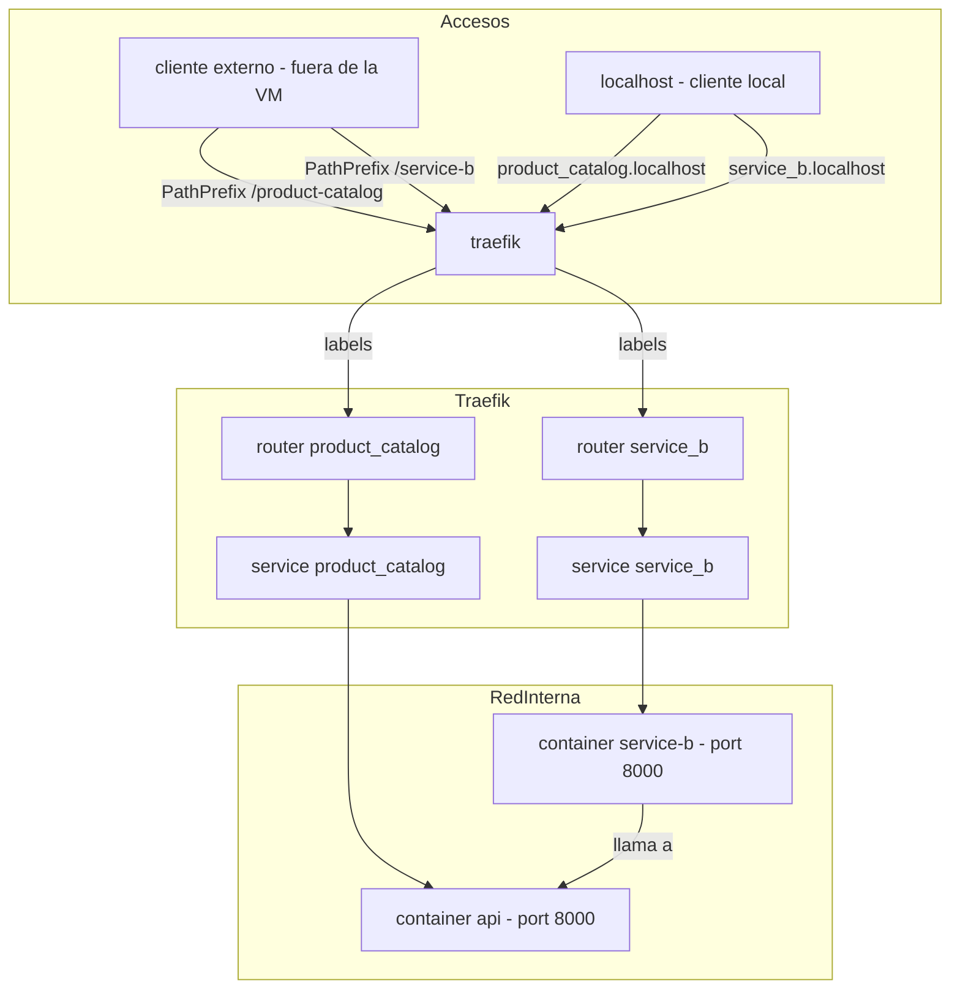
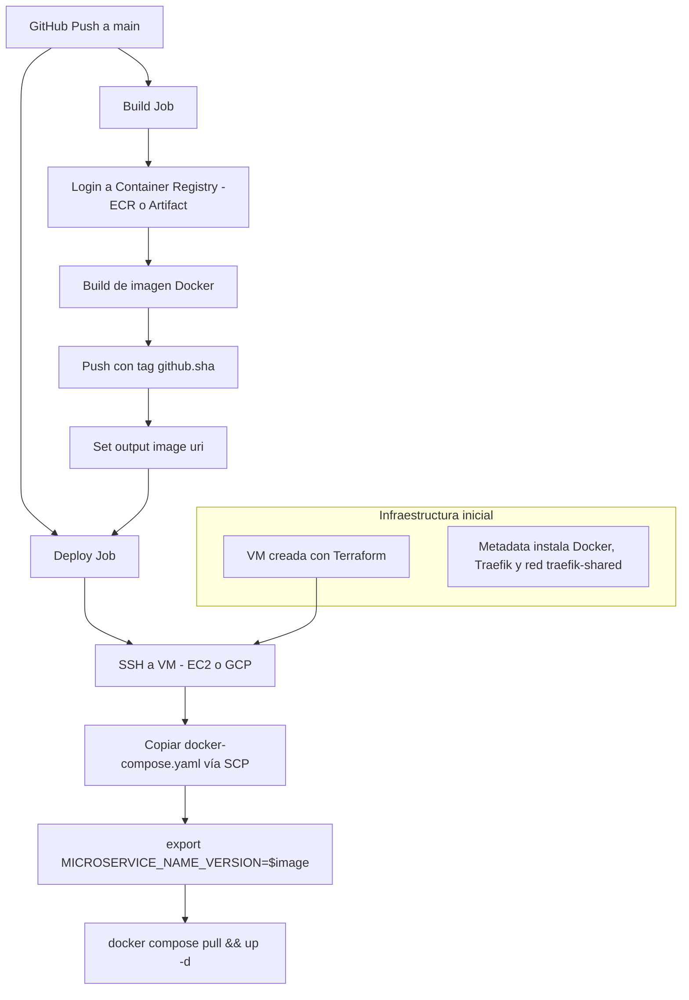

# 🚀 Cloud Computing Demo - Ingeniería del Software II  

Este repositorio contiene instrucciones detalladas y recursos utilizados durante la clase práctica de Cloud Computing. Aquí aprenderás desde los primeros pasos básicos hasta prácticas avanzadas con infraestructura como código y pipelines CI/CD usando AWS y GCP.

**Diapos**: [Cloud Computing Slides](https://www.figma.com/deck/yJpxpjW6aJOpFBCW7TE1xW/ISW2---Cloud-Computing?node-id=1-660&t=ep8V4cm1Nw0F9j6b-1)

## 🧱 Paso 0: Configuración Inicial de AWS

Antes de empezar, asegurate de configurar correctamente tu entorno AWS:

**Video Explicativo**: [AWS Setup](https://drive.google.com/file/d/19cXLmVaiaNkhtlqN130TJ3S2vEd0XeDB/view)

### 🌐 Creación de Cuenta AWS

1. Ingresa a [AWS Sign-up](https://aws.amazon.com) y crea una cuenta nueva con tu correo electrónico.
2. Verifica tu dirección email mediante el código enviado por AWS.
3. Selecciona tipo de cuenta: **Personal**.
4. Realiza la verificación con tarjeta de crédito/débito.
5. Completa la verificación con número de teléfono (SMS).
6. Selecciona el plan **Basic Support** (gratuito).

### 💳 Gestión de Costos y Alertas  

1. Activa el acceso al panel de Billing desde IAM.
2. En Billing → **Alert Preferences**, configura alertas vía email.
3. En Budgets, crea un presupuesto llamado **Zero spend budget** para monitorear gastos en tiempo real.

### 🔐 Creación de Usuario IAM y CLI  

1. En IAM, crea un usuario administrador: `iamadmin` y habilita MFA (Autenticación Multifactor).
2. Guarda tu URL de login personalizada para IAM:
    ```
    https://<account_id>.signin.aws.amazon.com/console
    ```
3. Descarga e instala la [AWS CLI](https://aws.amazon.com/cli/).

### 🖥️ Configuración Local con AWS CLI  

Configura tu usuario IAM localmente:

```bash
aws configure --profile iamadmin-general
```

Verifica configuración:

```bash
aws sts get-caller-identity --profile iamadmin-general
```

---

## ☁️ Demo 1: Lanzando Tu Primera Instancia EC2

Aprenderás a desplegar y acceder a una máquina virtual en la nube AWS.

### 🔑 Generar Key Pair

- Ve a EC2 → Key Pair → Crea una nueva clave y descárgala (`tu_key.pem`).

### 🚦 Crear Security Group

- Configura un Security Group que permita conexiones SSH (puerto 22) desde cualquier IP (`0.0.0.0/0`).

### 🚀 Lanzar Instancia EC2  

- Selecciona instancia tipo `t3.micro` con Ubuntu Linux.
- Usa la clave y Security Group creados anteriormente.

### 🔌 Conexión SSH a EC2  

```bash
ssh -i "tu_key.pem" ubuntu@<EC2_PUBLIC_IP>
```

### 🗑️ Destruir instancia

- Ve a EC2 → Instancias → Selecciona la instancia y destrúyela.
- Elimina el Security Group creado.
- Elimina la Key Pair.


### 🌳 Automación con Terraform  

Automatiza estos pasos con Terraform:

```bash
terraform init
terraform plan -var="ssh_key_name=tu_ssh_key_name"
terraform apply -var="ssh_key_name=tu_ssh_key_name"
terraform destroy -var="ssh_key_name=tu_ssh_key_name"
```

📁 **Assets:** disponibles en carpeta [**01-demo**](https://github.com/ingenieria-del-software-2/cloudcomputing-demo/tree/main/01-demo)

---

## 🗃️ Demo 2: Gestión de Acceso con IAM y S3

Control de acceso y políticas IAM avanzadas con CloudFormation.

### 📦 Despliegue CloudFormation Stack  

La plantilla crea:

- Dos buckets S3 (`cats` y `dogs`).
- Usuario IAM: `Messi`.
- Política IAM: acceso a todo excepto al bucket `dogs`.

### 📤 Uso del Bucket S3  

- En `cats`: sube imágenes de gatos.
- En `dogs`: sube imágenes de perros.

### 🛡️ Verificación Acceso IAM  

- Inicia sesión con usuario Messi en ventana incógnita.
- Intenta acceder al bucket `dogs`: **el acceso debe ser denegado**.

### 🔧 Modificación de la Política  

- Elimina política actual.
- Aplica política que permita **únicamente acceso al bucket `dogs`**.

### 🗑️ Limpieza  

- Elimina archivos S3.
- Desasocia política IAM del usuario Messi.
- Destruye stack CloudFormation.

📁 **Assets:** disponibles en carpeta [**2-demo**](https://github.com/ingenieria-del-software-2/cloudcomputing-demo/tree/main/01-demo)

---

## 🔄 Demo 3: CI/CD con EC2, Docker y Traefik

Esta demo está completamente automatizada con **Terraform**. En el bloque `user_data` (metadata de EC2) se incluye:

- Instalación de Docker y Docker Compose.
- Creación de red compartida `traefik-shared`.
- Despliegue único de Traefik y Jaeger con Compose.

Cada microservicio se encuentra en su propio repositorio y tiene su propio archivo `compose.prod.yaml` que referencia la variable `<MICROSERVICE_NAME>_VERSION`, la cual es inyectada automáticamente en el deploy desde GitHub Actions. Ejemplos: [kiosko-fiuba-product-catalog](https://github.com/ingenieria-del-software-2/kiosko-fiuba-product-catalog/blob/main/compose.prod.yml) y [kiosko-fiuba-shopping-experience](https://github.com/ingenieria-del-software-2/kiosko-fiuba-shopping-experience/blob/main/compose.prod.yml). Es importante que este compose, tenga la red externa de Traefik configurada como `traefik-shared` y a su vez todas las variables de entorno y labels necesarias para el despliegue.

Además, esta demo cuenta con una **versión opcional para GCP**, que replica el mismo pipeline y despliegue utilizando una VM en Google Cloud y `gcloud CLI` en lugar de AWS CLI.

📁 Los assets para esta demo están en la carpeta [**03-demo**](https://github.com/ingenieria-del-software-2/cloudcomputing-demo/tree/main/03-demo)

### Diagrama de arquitectura de los servicios (Traefik y Microservicios)


```mermaid
graph TD
  subgraph Accesos
    ext[cliente externo - fuera de la VM]
    local[localhost - cliente local]
    ext -->|PathPrefix /product-catalog| T
    local -->|product_catalog.localhost| T
    ext -->|PathPrefix /service-b| T
    local -->|service_b.localhost| T
  end

  subgraph RedInterna
    direction LR
    MS2[container service-b - port 8000]
    C[container api - port 8000]
    MS2 -->|llama a| C
  end

  subgraph Traefik
    T[traefik]
    T -->|labels| R1[router product_catalog]
    R1 --> S1[service product_catalog]
    S1 --> C

    T -->|labels| R2[router service_b]
    R2 --> S2[service service_b]
    S2 --> MS2
  end
```

### Pipeline CI/CD


```mermaid
graph TD
  A[GitHub Push a main] --> B[Build Job]
  B --> C[Login a Container Registry -ECR o Artifact]
  C --> D[Build de imagen Docker]
  D --> E[Push con tag github.sha]
  E --> F[Set output image uri]

  A --> G[Deploy Job]
  F --> G
  G --> H[SSH a VM - EC2 o GCP]
  H --> I[Copiar docker-compose.yaml vía SCP]
  I --> J[export MICROSERVICE_NAME_VERSION=$image]
  J --> K[docker compose pull && up -d]

  subgraph Infraestructura inicial
    L[VM creada con Terraform]
    M[Metadata instala Docker, Traefik y red traefik-shared]
  end

  L --> H
```

---

## 🔑 Secrets utilizados en el pipeline (GitHub Actions)

Estos secretos deben configurarse en la sección **Settings > Secrets and variables > Actions** del repositorio de GitHub.

### 🔸 **AWS**

| Secreto                  | Descripción                                                                 |
|--------------------------|-----------------------------------------------------------------------------|
| `AWS_ACCESS_KEY_ID`      | Access key del usuario IAM `pipeline-user`                                  |
| `AWS_SECRET_ACCESS_KEY`  | Secret key del usuario IAM `pipeline-user`                                  |
| `AWS_ACCOUNT_ID`         | ID numérico de tu cuenta AWS (sin espacios ni guiones)                      |
| `EC2_HOST`               | Dirección IP o DNS público de la instancia EC2                              |
| `EC2_SSH_KEY`            | Clave privada del Key Pair utilizada por EC2 (formato texto plano, sin passphrase) |

> 🧠 El URI del repositorio ECR se construye automáticamente en el pipeline como:  
> `\${{ secrets.AWS_ACCOUNT_ID }}.dkr.ecr.us-east-1.amazonaws.com`

### 🔹 **GCP**

| Secreto                   | Descripción                                                                   |
|---------------------------|-------------------------------------------------------------------------------|
| `GCP_PROJECT_ID`          | ID del proyecto de GCP                                                        |
| `GCP_SERVICE_ACCOUNT_KEY` | JSON con credenciales del Service Account `pipeline-user`                     |
| `GCP_USERNAME`            | Nombre de usuario para SSH (usualmente es el username de la cuenta de Google) |
| `GCP_VM_HOST`             | Dirección IP o DNS público de la instancia VM de GCP                          |
| `GCP_SSH_KEY`             | Clave privada para conexión SSH (sin passphrase, en texto plano)              |

> 🧠 El URI de la imagen en Artifact Registry se construye así:  
> `\${{ secrets.REGION }}-docker.pkg.dev/\${{ secrets.GCP_PROJECT_ID }}/<repo>/<microservicio>:<tag>`

## ⚠️ APIs de Google Cloud requeridas

Para que el pipeline de despliegue en GCP funcione correctamente, debes habilitar las siguientes APIs en tu proyecto de Google Cloud:

- **Compute Engine API** - Para el despliegue y gestión de VMs
- **IAM Credentials API** - Para la autenticación y autorización del Service Account

Puedes habilitar estas APIs desde la consola de Google Cloud o usando el siguiente comando:

```bash
gcloud services enable compute.googleapis.com iamcredentials.googleapis.com
```

## 🔐 Permisos del Pipeline

Tanto en AWS como en GCP, Terraform automatiza la creación de los roles, permisos y cuentas necesarios para el pipeline CI/CD. Sin embargo, las credenciales secretas (access keys y service account keys) deben obtenerse después del despliegue para configurarlas en GitHub Actions.

#### AWS - IAM User para ECR

Terraform crea el usuario IAM `pipeline-user` con permisos para publicar imágenes en ECR. Para obtener sus credenciales:

```bash
# ⚠️ Primero, edita el archivo terraform.tfvars para configurar tus variables (ssh_key_name, etc.)

# Aplica la configuración Terraform si no lo has hecho
terraform apply

# Obtén las credenciales (generadas automáticamente)
terraform output -raw AWS_ACCESS_KEY_ID
terraform output -raw AWS_SECRET_ACCESS_KEY
```

**Configuración en GitHub Actions**:
Usa las credenciales obtenidas para configurar los secretos en GitHub Actions según la tabla de AWS mostrada anteriormente.

**Uso en workflow**:
```yaml
- name: Configure AWS credentials
  uses: aws-actions/configure-aws-credentials@v1
  with:
    aws-access-key-id: ${{ secrets.AWS_ACCESS_KEY_ID }}
    aws-secret-access-key: ${{ secrets.AWS_SECRET_ACCESS_KEY }}
    aws-region: us-east-1
```

#### GCP - Service Account para Artifact Registry

Terraform crea la cuenta de servicio `pipeline-user` con permisos para publicar en Artifact Registry. Para obtener su clave:

```bash
# ⚠️ Primero, edita el archivo terraform.tfvars para configurar tus variables (project_id, etc.)

# Aplica la configuración Terraform si no lo has hecho
terraform apply

# Extrae la clave JSON (codificada en base64)
terraform output -raw GCP_SERVICE_ACCOUNT_KEY_ENCODED | base64 --decode > gcp_service_account_key.json
```

**Configuración en GitHub Actions**:
Usa el archivo `gcp_service_account_key.json` generado para configurar el secreto `GCP_SERVICE_ACCOUNT_KEY` en GitHub Actions.

**Uso en workflow**:
```yaml
- name: Auth to Google Cloud
  uses: google-github-actions/auth@v1
  with:
    credentials_json: ${{ secrets.GCP_SERVICE_ACCOUNT_KEY }}
```

**Limpieza de seguridad**: Después de configurar los secretos, elimina las credenciales locales:
```bash
rm gcp_service_account_key.json  # Para GCP
```

## 🧹 Limpieza Final  

Luego de la clase:

- Borra instancias EC2 y Key Pair usados.
- Vacía y elimina buckets S3.
- Usa Terraform para destruir todos los recursos creados:

```bash
terraform destroy
```

---

## 🧠 Buenas Prácticas  

- Usa siempre perfiles IAM limitados para mejorar seguridad.
- Habilita MFA en cuenta root AWS.
- Usa siempre `terraform plan` antes de aplicar cambios.
- Revisa siempre logs detallados ante errores (CloudFormation, Terraform).
- Para practicar IAM, usa múltiples ventanas o sesiones separadas.

---

📌 **¡Buena suerte y a disfrutar la clase!**
